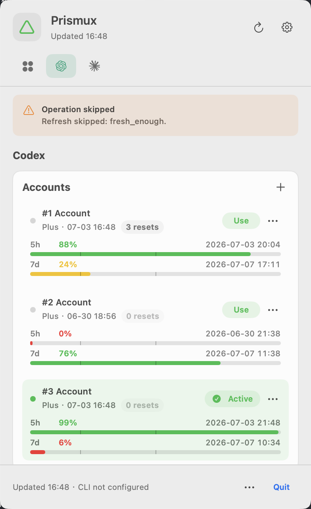

<div align="center">


# Prismux

**A local account switcher for AI coding tools.**

English | [简体中文](README.zh-CN.md)

[](LICENSE)
[](rust-toolchain.toml)
[](#supported-platforms)
[](ROADMAP.md)

</div>

Prismux helps you keep multiple local accounts for AI coding tools, see which
one is active, and switch by number or alias without repeating browser login
flows. It is designed as a small local control surface for the tools you already
use.

<div align="center">



</div>

## Contents

- [Overview](#overview)
- [Name and Icon](#name-and-icon)
- [Install](#install)
- [Quick Start](#quick-start)
- [Common Commands](#common-commands)
- [Supported Tools](#supported-tools)
- [More Documentation](#more-documentation)

## Overview

- A local control surface for AI coding tool accounts.
- A desktop app for quick account visibility and switching.
- A `prismux` CLI for terminal workflows and remote-friendly usage.
- Local account snapshots for supported tools.
- Aliases and numbered account pools for fast account switching.
- Credential-conscious behavior: Prismux does not print raw tokens or store raw
  auth payloads in registry metadata.

## Name and Icon

The name **Prismux** combines **prism** and **mux**. A prism splits and reveals
different paths of light; a multiplexer chooses one active path from many. That
maps to the product idea: keep several local accounts available, then switch the
active one cleanly when your workflow needs it.

The icon is a small tribute to Pink Floyd's prism imagery: light enters, splits,
and becomes something organized and expressive. Prismux borrows that visual idea
for local account switching.

## Install

### Desktop App

Download the app archive from:

```text
https://github.com/hiQianFan/prismux/releases
```

For the current macOS release, unpack it, move `Prismux.app` to
`/Applications`, and open it from Finder.

### CLI Package

Release builds also provide a ready-to-use CLI package:

```text
prismux-cli-vX.Y.Z-macos-arm64.tar.gz
```

Install it with:

```sh
tar -xzf prismux-cli-vX.Y.Z-macos-arm64.tar.gz
cd prismux-cli-vX.Y.Z-macos-arm64
./install.sh
```

Then verify:

```sh
prismux --version
prismux status
```

The desktop app also includes the matching `prismux` command. In Prismux
Settings, click `Enable prismux command` if you prefer to use the bundled helper.

For manual install details, see the [install guide](docs/INSTALL.md).

## Quick Start

Check detected tool homes and active accounts:

```sh
prismux status
```

Add a Codex account through the official Codex login flow:

```sh
prismux login codex
```

Add a Claude Code account:

```sh
prismux login claude --alias work
```

List saved accounts:

```sh
prismux list
```

Switch by number or alias:

```sh
prismux use codex 2
prismux use claude work
```

## Common Commands

| Command | Use |
| --- | --- |
| `prismux status` | Show detected tool homes and current account state. |
| `prismux login codex` | Add a Codex account using the official login flow. |
| `prismux login codex --device-auth` | Add a Codex account on remote or browserless machines. |
| `prismux login claude --alias work` | Add a Claude Code OAuth account and name it `work`. |
| `prismux list` | Show all saved accounts. |
| `prismux list codex` | Show saved Codex accounts only. |
| `prismux use codex 2` | Switch Codex to account number 2. |
| `prismux use claude work` | Switch Claude Code to the `work` account. |
| `prismux alias codex 2 work` | Set or update an account alias. |

See the [CLI guide](docs/CLI.md) for more examples.

## Supported Tools

| Tool | Status | Notes |
| --- | --- | --- |
| Codex | Supported | Login wrapper, device auth, account list, alias, switch, profile import, quota display. |
| Claude Code | Supported | OAuth account snapshots, gateway/API profiles, macOS Keychain support. |
| Gemini CLI | Planned | Not implemented yet. |

## Supported Platforms

| Platform | Status | Notes |
| --- | --- | --- |
| macOS Apple Silicon | Supported | Official `Prismux.app` release target. |
| macOS Intel | Not planned | Source builds may work; no official app bundle. |
| Linux | Planned | Source builds may work; no official release binary yet. |
| Windows | Planned | Requires credential, permission, and external CLI validation. |

## Safety

Prismux works with local credential files, so it is intentionally conservative:

- It does not print raw tokens or raw auth payloads.
- Registry files store metadata and hashes, not raw auth material.
- Active credentials are backed up before replacement.
- Snapshot hashes are verified before switching.

For details and private vulnerability reporting, see [SECURITY.md](SECURITY.md).

## More Documentation

- [Install guide](docs/INSTALL.md)
- [CLI guide](docs/CLI.md)
- [Build from source](docs/BUILD.md)
- [Contributing](CONTRIBUTING.md)
- [Architecture](docs/ARCHITECTURE.md)
- [Product scope](docs/PRD.md)
- [Roadmap](ROADMAP.md)
- [Release guide](docs/RELEASE.md)

## License

MIT
